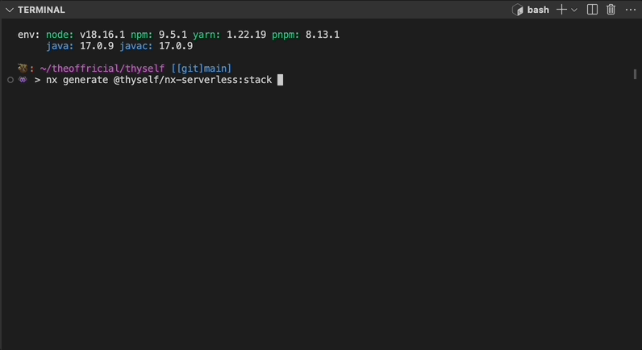
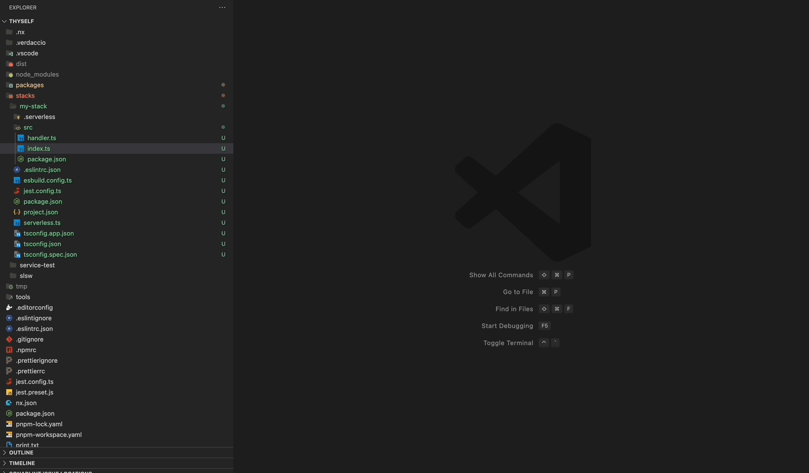
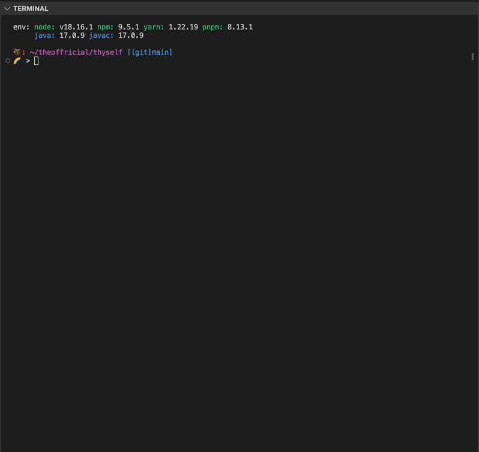
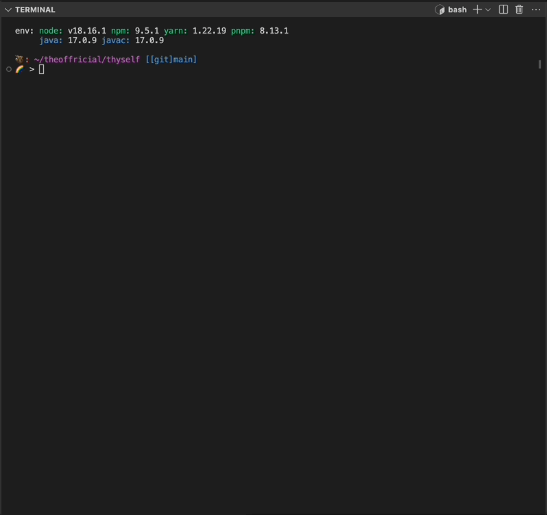

# NX Serverless


A full Serverless framework support, both executor & generator, for the NX environment.

**_Currently in beta (major lower than 1.0.0)_**

## Features

* NX executor with a full support of the Serverless CLI.
* NX generator to generate new serverless stacks (projects) out-of-the-box
    * Support `npm`, `yarn` and `pnpm` environments.
    * Support of `serverless-esbuild`, `serverless-webpack`, `serverless-plugin-typescript`.
* Cold-start optimized setup using the Serverless & AWS best-practices.
* Advanced setup & Fully documented serverless setup when using `esbuild` or `webpack` that optimized for both the local environment and cloud environments.

## Install

```bash
// npm
npm i -D @thyself/nx-serverless
// yarn
yarn add @thyself/nx-serverless -D
// pnpm
pnpm add @thyself/nx-serverless -D -w
```

## Usage

### Generator

#### Generating a new stack

Currently the generator supports the `stack` option.
Then you will need to choose package manager and bundler.

* package managers - Support all top package managers
    * Available package managers: `pnpm`, `npm`, `yarn`
* bundler - Supports state-of-the-art fully configured serverless bundlers optimized for coldstart.
    * Available stack bundlers: `webpack (serverless-webpack)`, `esbuild (serverless-esbuild)`, `tsc (serverless-plugin-typescript)`




#### Templates

According to the `package manager` and `bundler` you chose the template will be generated.



### Executor

The `@thyself/nx-serverless` fully supports all _[Serverless Framework CLI commands and options](https://www.serverless.com/framework/docs/providers/aws/cli-reference)_.
The templates (project.json) by default generated with `start-offline`, `package`, `deploy`, `print`, and `remove` commands.

#### Configuring commands

If a commands in serverless CLI compounds from several arguments, concat them with dashes `-`, for example: `serverless deploy list functions`, for the executor is: `deploy-list-functions`

```json
// project.json
// ...
targets: {
    // ...more targets
    "<target-name>": {
      "executor": "@thyself/nx-serverless:<serverless-cli-command>",
      "options": {
        "cwd": "<appsDir>/<stack-dir-name>",
        // ...more options
      }
    },
    // serverless deploy list functions
    "list-deployed-functions": {
      "executor": "@thyself/nx-serverless:deploy-list-functions",
      "options": {
        // Common appsDir is "stacks"
        "cwd": "<your-nx-workspaceLayout-appsDir>/<stack-dir-name>",
        // ...more options
      }
    },
    // ...more targets
}
```

#### Example #1: serverless offline start 



#### Example #2: serverless package 



## VScode Debug (launch.json) Setup for NX

The setup can be configured both on the user's level launch settings or in the project's settings.

Recommended to installing `nx` and `serverless` globally.

```json
// User's settings.json
// ...more options
    "launch": {
        "inputs": [
            {
                "id": "nx-project-name",
                "description": "Enter NX project from workspace. e.g. my-package",
                "default": "my-app",
                "type": "promptString",
            },
            {
                "id": "nx-project-command",
                "description": "Enter project command from project.json. e.g. test/lint/build/etc.",
                "default": "my-command",
                "type": "promptString",
            },
            {
                "id": "command-flags",
                "description": "Enter flags to be attached to your command",
                "default": "",
                "type": "promptString",
            }
        ],
        "version": "0.2.0",
        "configurations": [
            {       
                "name": "Nx Debug", // check: https://stackoverflow.com/questions/48273346/vscode-command-for-user-input-in-debug-launch-config
                "type": "node",
                "request": "launch",
                "runtimeExecutable": "nx",
                "args": [
                    "run",
                    "--project",
                    "${input:nx-project-name}",
                    "${input:nx-project-command}",
                    // "--",
                    // "${input:command-flags}",
                ],
                "runtimeArgs": [
                ],
                "env": {
                    "SLS_DEBUG": "*",
                },
                "skipFiles": [
                    "<node_internals>/**",
                ],
                "restart": true,
                "outFiles": [
                    "${workspaceFolder}/**/.esbuild/**/*.js",
                    "${workspaceFolder}/**/.webpack/**/*.js",
                    "${workspaceFolder}/**/.build/**/*.js",
                ],
                "outputCapture": "std",
                "sourceMaps": true,
	            "smartStep": true,
                "resolveSourceMapLocations": [
                    "${workspaceFolder}/**",
                    "${workspaceFolder}/**/.esbuild/**/*.js.map",
                    "!**/node_modules/**"
                ],
                "pauseForSourceMap": true,
                "internalConsoleOptions": "neverOpen"
            }
        ]
    }
```


## Backwards Compatibility & Legacy Serverless versions

The entire plugin developed on newest versions of both `nx@17` and `serverless@3`,
and not tested on legacy environments, so it can't be guaranteed.

